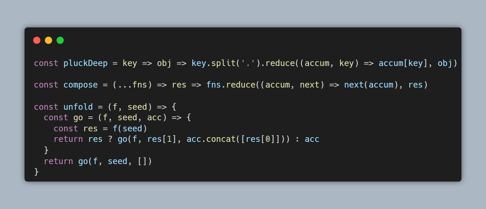

# **Mega Man Robots API**
(MEGA-MAN-ROBOTS)

## Contexto
Este projeto é uma API desenvolvida em .NET Core 3.1, cujo objetivo principal é fornecer informações sobre os bosses da franquia Megaman em formato JSON.

### Exemplo de Resposta JSON

