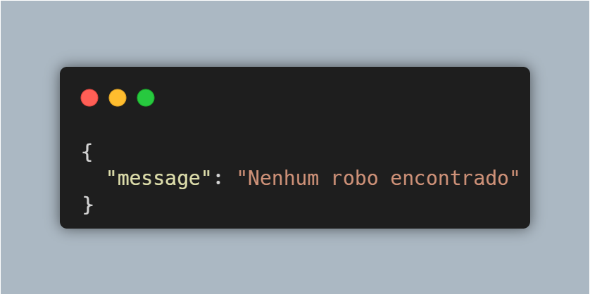

# **Mega Man Robots API**
(MEGA-MAN-ROBOTS)

## Contexto
Este projeto é uma API desenvolvida em **.NET Core 3.1**, cujo objetivo principal é fornecer informações sobre os bosses da franquia **Megaman** em formato **JSON**.

> ### Exemplo de Resposta JSON


## Estrutura do Projeto
```
.vs
.vscode
bin
Controllers
Database
middlewares
Models
obj
Properties
Services
appsettings.Development.json
appsettings.json  
global.json
MegamanApi.csproj  
MegamanApi.sln
Program.cs
Startup.cs
```

## Dependências
O projeto utiliza as seguintes dependências:

| Dependência | Versão |
|------------|--------|
| [Microsoft.EntityFrameworkCore](https://www.nuget.org/packages/Microsoft.EntityFrameworkCore/) | 3.1.8 |
| [Microsoft.EntityFrameworkCore.Design](https://www.nuget.org/packages/Microsoft.EntityFrameworkCore.Design/) | 3.1.8 |
| [Microsoft.EntityFrameworkCore.SqlServer](https://www.nuget.org/packages/Microsoft.EntityFrameworkCore.SqlServer/) | 3.1.8 |
| [Newtonsoft.Json](https://www.nuget.org/packages/Newtonsoft.Json/) | 12.0.2 |

## Endpoints

### Listar todos os robôs
**GET** `/api/v1/robots`

### Obter robô por ID
**GET** `/api/v1/robots/{id}`

- Retorna um robô específico pelo ID
- Se o robô não for encontrado, retorna:


### Criar um novo robô
**POST** `/api/v1/robots`

## Execução
1. Clone o repositório
```bash
git clone <URL_DO_REPOSITORIO>
cd megaman-api
```
2. Restaure as dependências
```bash
dotnet restore
```
3. Execute a aplicação
```bash
dotnet run
```

## Autor README
[](https://github.com/camillyaalves/)
